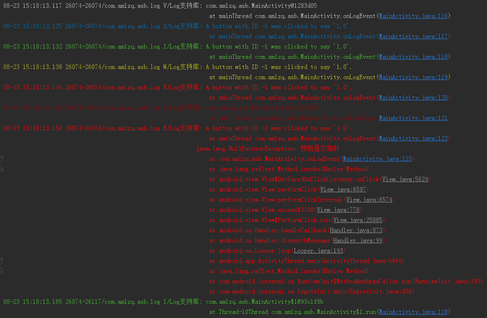

# android-support-log
* dependencies Android API 27 Platform
* dependencies JDK

```
在实际项目中，需要记录Log时通常并不会直接使用android.util.Log类的static方法，而是再封装一个自己的Log类，在这个Log类中调用android.util.Log类的static方法，在需要记录Log时调用封装的Log类。这样做有如下几个好处。

1. 对tag进行控制。应用中如果让每个需要记录Log的地方自行设置tag，会导致每个消息的tag都不一样。tag起不到应有的作用。相反，在封装的Log类中可以将tag统一起来，约束只使用若干固定的tag。增加，删除和修改tag都会非常方便。
2. 增加Log全局开关。在封装的Log类中可以增加开关，通过一个boolean参数就可以控制所有的Log的显示和关闭。还可以单独控制某个类型或某个tag的Log的显示和关闭。
3. 在调用android.util.Log两个参数的static方法时，如果msg参数为null会导致空指针异常。在封装的Log中可以对参数进行判断，如果msg为null时不处理。避免出现程序异常。
```

## 发布
* 最新版本

| groupId | artifactId | version |
| -------- | -------- | -------- |
| com.amlzq.android | log | [  ](https://bintray.com/amlzq/android-support-base/log/_latestVersion) |

## 使用
* 配置依赖
```
dependencies{
    ...
    implementation 'com.amlzq.android:log:latest.integration'
}
```
* 初始化
```
        // 设置全局标签
        Log.TAG = getString(R.string.app_name);

        // 设置全局日志等级
        Log.LEVEL = Log.VERBOSE;

        // Wraps Android's native log framework.
        LogWrapper logWrapper = new LogWrapper();
        // Using Log, front-end to the logging chain, emulates android.util.log method signatures.
        Log.setLogNode(logWrapper);
```
* 打印日志
```
        Log.v(this);
        Log.d("A button with ID %s was clicked to say '%s'.", view.getId(), view.getAlpha());
        Log.i("A button with ID %s was clicked to say '%s'.", view.getId(), view.getAlpha());
        Log.w("A button with ID %s was clicked to say '%s'.", view.getId(), view.getAlpha());
        Log.e("A button with ID %s was clicked to say '%s'.", view.getId(), view.getAlpha());
        Log.wtf(this);

        Log.e(String.format("A button with ID %s was clicked to say '%s'.", view.getId(), view.getAlpha()), new NullPointerException("按钮是空指针"));

        new Thread(new Runnable() {
            @Override
            public void run() {
                Log.i(this);
            }
        }).start();
```
* 输出日志<br>


## 工程结构
* ./log
> log library
```
package: com.amlzq.android.log
```
* ./sample
> sample application
```
package: com.amlzq.asb
appName: Log支持库
applicationId: com.amlzq.asb.log
```

## 其他优秀的Android log库
* [orhanobut/logger](https://github.com/orhanobut/logger)
* [JakeWharton/timber](https://github.com/JakeWharton/timber)
